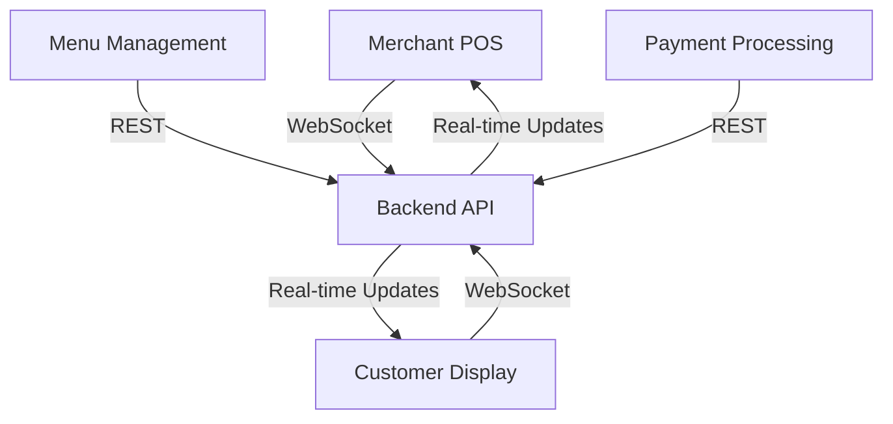

# 🏪 PrimeGrills POS System

A modern Point of Sale system for restaurant management built with React, TypeScript, and Vite.


## 📋 Overview

PrimeGrills POS is a dual-interface system:
- 💼 **Merchant Interface**: For staff to manage orders and transactions
- 👥 **Customer Display**: Real-time order tracking for customers

## 🏗 Architecture



## 🚀 Features

### Order Management
- ➕ Real-time item selection and quantity management
- 💰 Dynamic price calculation with tax and discounts
- 🔄 Order type switching (Dine-in/Takeaway)
- 🛒 Split-screen order display

### Menu System
- 📱 Category-based menu organization
- 🖼️ Visual menu with product images
- 💲 Price display and formatting
- ✨ Interactive item selection

### Payment Processing
- 💳 Order total calculation
- 🧾 Tax and discount handling
- 📊 Order status tracking
- 🔄 Processing state management

## 📦 Project Structure

```bash
PrimeGrillsPOS/
│── src/
    |-- assets/
        |-- images/
        |-- styles/
│   ├── components/
│   │   ├── OrderTemplate.tsx      # Order management components
        |-- FoodItems.tsx
        |-- Menus.tsx
        |-- headerBar.tsx
│   │   ├── ClientOrderTemplate.tsx     # Customer view
        |-- ClientMenus.tsx
│   │   ├── Menus/             # Menu display components
│   │   ├── UI/                 # Reusable UI component
            |-- Button.tsx
            |-- Card.tsx
            |              
│   ├── Pages/
│   │   ├── MainFrame.tsx      # Main layout
│   │   ├── Orders.tsx         # Order history
│   │   ├── Settings.tsx       # System settings
│   ├── context/
│   │   ├── OrderContext.tsx   # Order state management
│   │   ├── MenuContext.tsx    # Menu state management
│   ├── services/
│   │   ├── websocket.ts       # WebSocket configuration
│   │   ├── api.ts            # REST API services
│   ├── utils/
│   │   ├── currency.ts        # Currency formatting
│   │   ├── calculations.ts    # Price calculations
```

## 🛠️ Technical Implementation

### WebSocket Integration
```typescript
const ws = new WebSocket('ws://your-server-url');
ws.onmessage = (event) => {
    const data = JSON.parse(event.data);
    // Handle updates
};
```

### Order Processing Flow
1. Item Selection → Cart Addition
2. Quantity Adjustment
3. Tax/Discount Application
4. Total Calculation
5. Payment Processing
6. Receipt Generation

## 🎯 Core Components

### OrderTemplate
- Manages active order state
- Handles item additions/removals
- Calculates totals
- Processes payments

### ClientOrderTemplate
- Displays real-time order updates
- Shows running total
- Indicates processing status

### Menus
- Displays available items
- Shows prices and images
- Indicates item availability

## 🚗 Getting Started

1. **Clone & Install**
```bash
git clone <repository-url>
cd PrimeGrillsPOS
npm install
```

2. **Environment Setup**
```bash
cp .env.example .env
# Configure environment variables:
VITE_API_URL=your-api-url
VITE_WS_URL=your-websocket-url
```

3. **Development**
```bash
npm run dev
```

4. **Build & Deploy**
```bash
npm run build
npm run preview
```

## 🔧 Configuration

### Environment Variables
```env
VITE_API_URL=http://api.example.com
VITE_WS_URL=ws://websocket.example.com
VITE_TAX_RATE=0.10
VITE_DEFAULT_CURRENCY=NGN
```

### WebSocket Events
- `order.update`: Order changes
- `menu.update`: Menu availability
- `payment.status`: Payment processing

## 🔐 Security

- 🔒 JWT Authentication
- 👤 Role-based access
- 🔐 Encrypted WebSocket
- 🛡️ XSS Protection

## 🎨 UI/UX Features

- 📱 Responsive design
- ⚡ Real-time updates
- 🎯 Touch-optimized interface

## 🗺️ Routes Structure

- http://localhost:5173/
- http://localhost:5173/clientview


## 🤝 Contributing

1. Fork repository
2. Create feature branch
3. Commit changes
4. Push to branch
5. Create Pull Request

## 📚 Documentation

Additional documentation:
- [API Reference](docs/api.md)
- [WebSocket Protocol](docs/websocket.md)
- [UI Components](docs/components.md)
- [State Management](docs/state.md)

## 🐛 Issue Reporting

Report bugs via GitHub issues with:
- Expected behavior
- Actual behavior
- Steps to reproduce
- Environment details

---
Built with ❤️ using React + TypeScript + Vite


