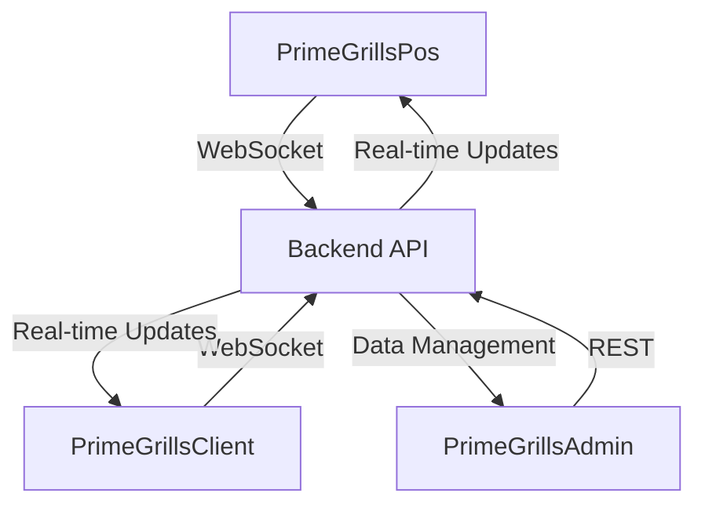

# 🍖 PrimeGrills Restaurant Management System

A modern, real-time restaurant management system with POS capabilities and client order tracking.


## 🌟 Overview

PrimeGrills consists of three main applications:
- 🏪 **PrimeGrillsPos**: Point of Sale system for staff
- 👥 **PrimeGrillsClient**: Real-time order tracking for customers
- 🎛 **PrimeGrillsAdmin**: Administrative dashboard for management

## 🏗 Architecture



## 🚀 Features

### POS System
- 💳 Order processing
- 🛒 Real-time inventory tracking
- 🧾 Receipt generation
- 📊 Daily sales tracking

### Client Interface
- 📱 Real-time order status
- 🔔 Order notifications
- 📖 Digital menu viewing
- 💫 Live updates

### Admin Dashboard
- 📈 Analytics & reporting
- 👥 User management
- 📦 Inventory control
- 🎯 Sales tracking

## 🛠 Tech Stack

- **Frontend**: React + TypeScript
- **Styling**: TailwindCSS
- **State Management**: React Context
- **Real-time**: WebSocket
- **Build Tool**: Vite
- **UI Components**: ShadcnUI

## 📦 Project Structure

```bash
primegrills/
├── Frontend/
│   ├── PrimeGrillsPos/       # POS Application
│   ├── PrimeGrillsClient/    # Client Order Tracking
│   └── PrimeGrillsAdmin/     # Admin Dashboard
└── Backend/                  # API Server
```

## 🚗 Getting Started

1. **Clone the repository**
```bash
git clone https://github.com/yourusername/primegrills.git
cd primegrills
```

2. **Install dependencies for each application**
```bash
# POS System
cd Frontend/PrimeGrillsPos
npm install

# Client Interface
cd ../PrimeGrillsClient
npm install

# Admin Dashboard
cd ../PrimeGrillsAdmin
npm install
```

3. **Environment Setup**
```bash
# Create .env files in each project directory
cp .env.example .env
```

4. **Start Development Servers**
```bash
# In separate terminals:
npm run dev  # For each application
```

## 🔌 WebSocket Integration

The system uses WebSocket for real-time communication:
- Order updates
- Menu availability
- Kitchen notifications
- Client order tracking

```typescript
// WebSocket connection example
const ws = new WebSocket('ws://your-server-url');
ws.onmessage = (event) => {
    const data = JSON.parse(event.data);
    // Handle real-time updates
};
```

## 🔐 Security

- JWT Authentication
- Role-based access control
- WebSocket secure connections
- Data encryption

## 📱 Responsive Design

The application is fully responsive across devices:
- 💻 Desktop POS system
- 📱 Mobile-friendly client interface
- 🎯 Adaptive admin dashboard

## 🤝 Contributing

1. Fork the repository
2. Create feature branch (`git checkout -b feature/AmazingFeature`)
3. Commit changes (`git commit -m 'Add AmazingFeature'`)
4. Push to branch (`git push origin feature/AmazingFeature`)
5. Open a Pull Request

## 📄 License

This project is licensed under the MIT License - see the [LICENSE](LICENSE) file for details.

## 🙏 Acknowledgments

- [React](https://reactjs.org/)
- [TailwindCSS](https://tailwindcss.com/)
- [TypeScript](https://www.typescriptlang.org/)
- [Vite](https://vitejs.dev/)
- [ShadcnUI](https://ui.shadcn.com/)

---
Made with ❤️ by [Your Team Name]
